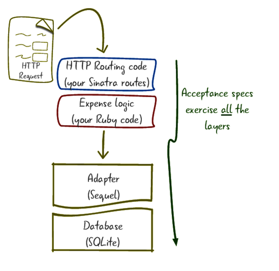

## Overview

App overview:

We'll use 4 libraries:
- RSpec to test the app
- Coderay for syntax highlighting
- Rack::Test to test the web services
- Sinatra - the web application
 
### Project setup

- install bundler `gem install bundler`
- generate Gemfile `bundler init`
- add the req'd gems and run bundler `bundle install`
- setup rspec `bundle exec rspec --init` (creates .rspec(loads spec_helper) and spec_helper.rb files)
	note: always use `bundle exec` to always run the versions of the libs your expecting
- add `ENV['RACK_ENV'] = 'test'` to the top of spec_helper - tells Sinatra to pass errprs to the test framework				
			
Workflow:
- decide what is the core behaviour of the project
- write the first part of that behaviour as a spec
- then implement the behaviour

Write the code you wish you had
- then fill in the implementation
- design thing's from the caller's perspective			